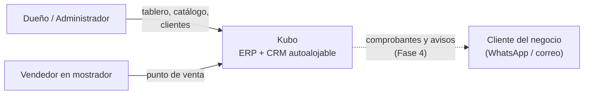
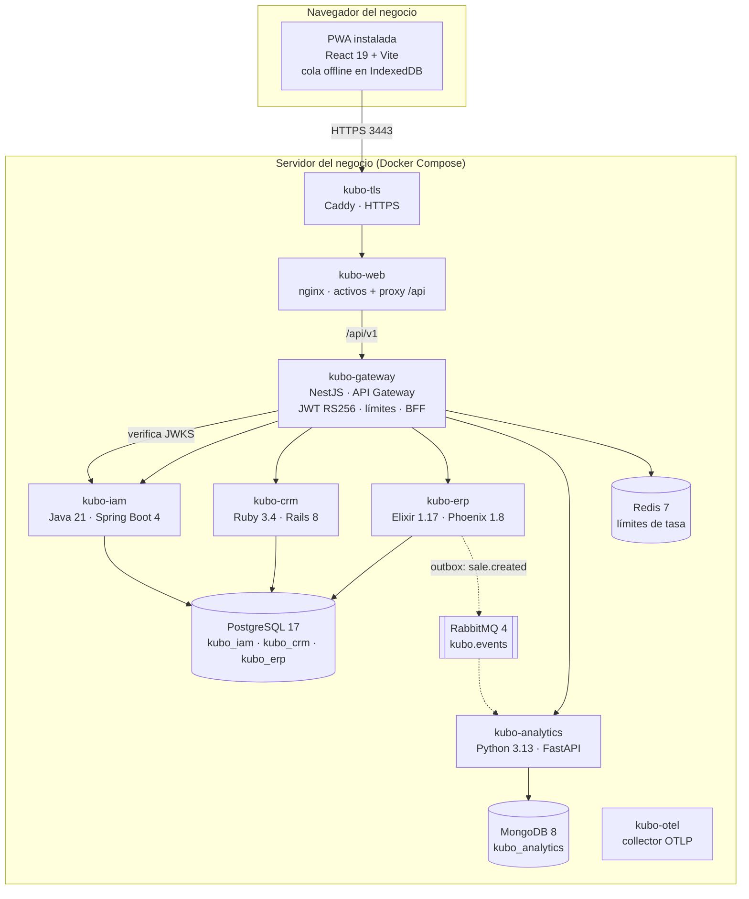
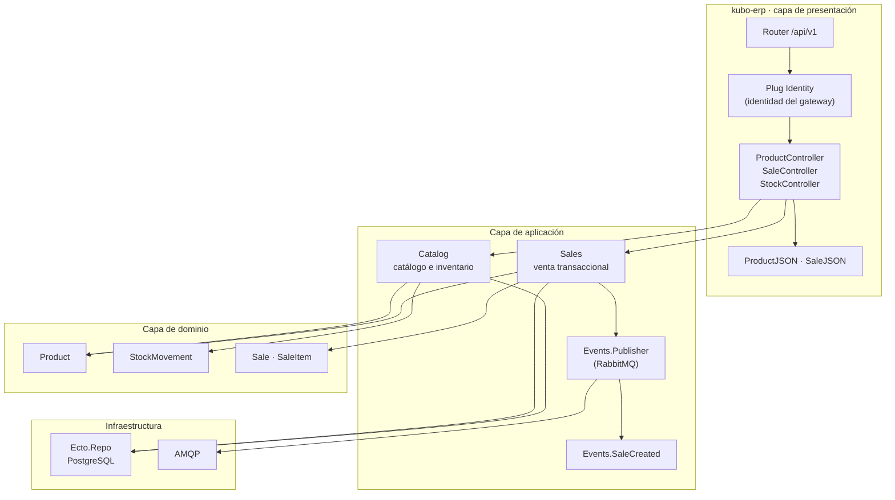
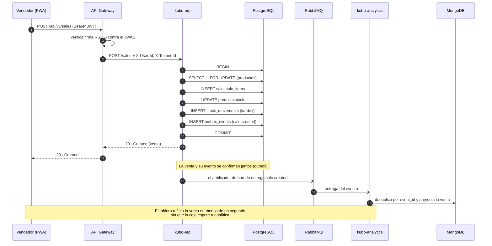
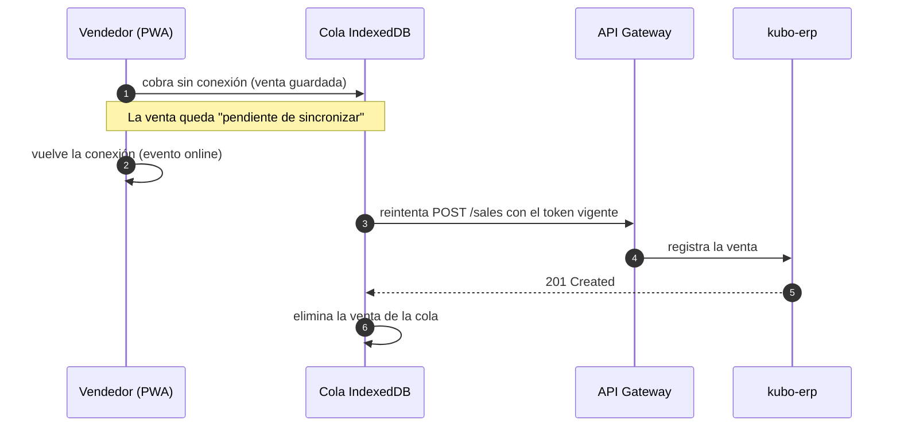

# 01 — Arquitectura

Kubo es un ERP + CRM autoalojable para PYMES. Se instala en el local del negocio
con un solo comando y opera como aplicación web instalable (PWA), incluso sin
conexión a internet.

## 1. Vista de contexto (C4 nivel 1)



## 2. Vista de contenedores (C4 nivel 2)



### Responsabilidad de cada contenedor

| Contenedor | Responsabilidad | Base de datos |
| --- | --- | --- |
| `kubo-gateway` | Único punto de entrada: valida el JWT contra el JWKS, aplica límites de tasa, propaga la identidad y la trazabilidad, enruta | Redis (límites) |
| `kubo-iam` | Negocios, usuarios, roles, tokens, auditoría | `kubo_iam` |
| `kubo-crm` | Clientes, cifrado de datos personales, cartera | `kubo_crm` |
| `kubo-erp` | Catálogo, inventario (kardex), ventas, anulación y **outbox** de eventos | `kubo_erp` |
| `kubo-analytics` | Modelo de lectura de ventas, indicadores del tablero | `kubo_analytics` (MongoDB) |
| `kubo-web` | Interfaz PWA; sirve los activos y proxea `/api` al gateway | — |
| `kubo-tls` | Terminación TLS (Caddy): HTTPS, redirección de HTTP y HSTS | — |
| `kubo-otel` | Collector OpenTelemetry: recibe las trazas OTLP de los cinco servicios (opcional: Tempo + Grafana) | — |

## 3. Vista de componentes (C4 nivel 3, ejemplo: `kubo-erp`)



Los otros servicios siguen la misma separación. La regla es que el dominio no
conoce HTTP, ni la base de datos, ni el bus de eventos.

## 4. Flujo crítico: registrar una venta



> Si el bus está caído, el evento **espera en la bandeja de salida**
> (`outbox_events`) y se entrega al volver; la venta ya está confirmada y el
> negocio sigue vendiendo. `make bus-drill` lo verifica (ver ADR-0009).

### Si no hay internet en el local



## 5. Atributos de calidad y cómo se sostienen

| Atributo | Mecanismo |
| --- | --- |
| **Escalabilidad** | Servicios sin estado (excepto las bases); el gateway escala horizontalmente porque los límites de tasa viven en Redis. Cada base puede migrar a su propia instancia sin tocar código. |
| **Disponibilidad** | Tolerancia a fallos en cadena: la venta no depende del bus ni de analítica; el gateway opera sin Redis (fail-open); cada contenedor tiene *healthcheck* y política de reinicio. |
| **Seguridad** | JWT asimétrico, cifrado de campos, aislamiento por negocio, auditoría encadenada, límites de tasa y validación en cada frontera. |
| **Mantenibilidad** | Un lenguaje por contexto con su ecosistema natural; arquitectura limpia dentro de cada servicio; contratos explícitos entre repos. |
| **Portabilidad** | Todo corre en Docker Compose: el mismo artefacto sirve para el mini-PC del local y para un servidor en la nube. |
| **Observabilidad** | Sonda `/health` en cada servicio con estado de sus dependencias, `correlation-id` propagado por el gateway y logs JSON estructurados. |
| **Costo** | Consumo en reposo cercano a 1 GB de RAM y 12 contenedores; cabe en un VPS de USD 6–12 al mes o en un equipo modesto del local. El stack visual de trazas (Tempo + Grafana) es opcional. |

## 6. Decisiones arquitectónicas

Cada decisión relevante está registrada como ADR:

| ADR | Decisión |
| --- | --- |
| [0001](adr/ADR-0001-microservicios-monolito-modular.md) | Microservicios con monolito modular interno |
| [0002](adr/ADR-0002-polyrepo-contratos.md) | Polyrepo con contratos como fuente de verdad |
| [0003](adr/ADR-0003-multitenancy-hibrido.md) | Multi-tenancy híbrido (`tenant_id` + RLS activo) |
| [0004](adr/ADR-0004-poliglotismo.md) | Poliglotismo deliberado: un lenguaje por contexto |
| [0005](adr/ADR-0005-eventos-rabbitmq.md) | Eventos con RabbitMQ y publicador tolerante a fallos |
| [0006](adr/ADR-0006-cifrado-campos.md) | Cifrado de campos personales con AES-256-GCM |
| [0007](adr/ADR-0007-jwt-rs256-jwks.md) | JWT RS256 con JWKS en el gateway |
| [0008](adr/ADR-0008-alcance-mvp.md) | Alcance declarado del MVP y recortes conscientes |
| [0009](adr/ADR-0009-outbox-transaccional.md) | Outbox transaccional para la entrega de eventos |
| [0010](adr/ADR-0010-rls-activo.md) | RLS activo con interceptor de transacción |
| [0011](adr/ADR-0011-bff-capa-formal.md) | BFF como capa formal del gateway |
| [0012](adr/ADR-0012-zona-horaria-por-negocio.md) | Zona horaria por negocio |
| [0013](adr/ADR-0013-vertical-packs.md) | Vertical Packs: el vertical como dato del negocio |
| [0014](adr/ADR-0014-puerto-facturacion-dian.md) | Facturación electrónica DIAN como puerto enchufable |
| [0015](adr/ADR-0015-segundo-factor-totp.md) | Segundo factor TOTP del propietario |

## 7. Estructura del workspace

```
Kubo/
├── README.md            índice y arranque rápido
├── Makefile             up · down · seed · smoke · pdf
├── kubo-gateway/        API Gateway (TypeScript + NestJS)
├── kubo-iam/            identidad (Java + Spring Boot)
├── kubo-crm/            clientes (Ruby + Rails)
├── kubo-erp/            catálogo, inventario y ventas (Elixir + Phoenix)
├── kubo-analytics/      tablero (Python + FastAPI + MongoDB)
├── kubo-web/            PWA (React + Vite + Tailwind)
├── kubo-infra/          Docker Compose, semilla y prueba de humo
└── kubo-docs/           esta documentación
```
