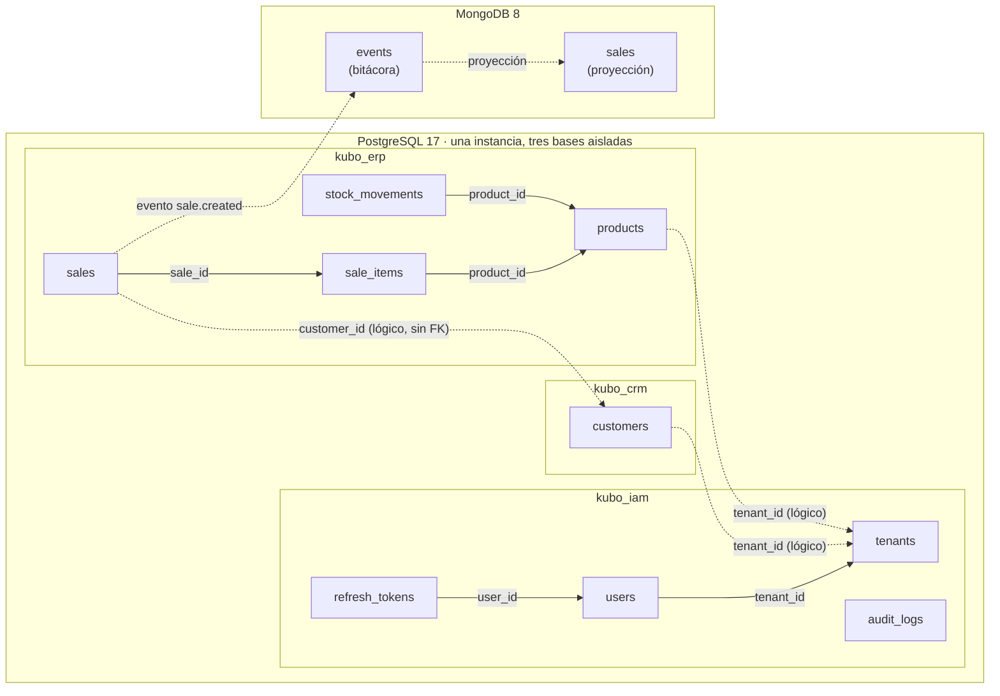
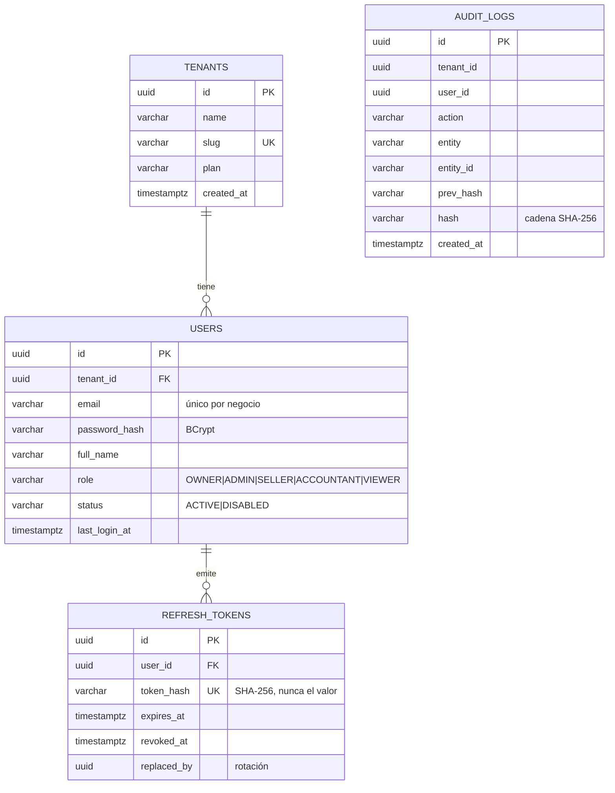
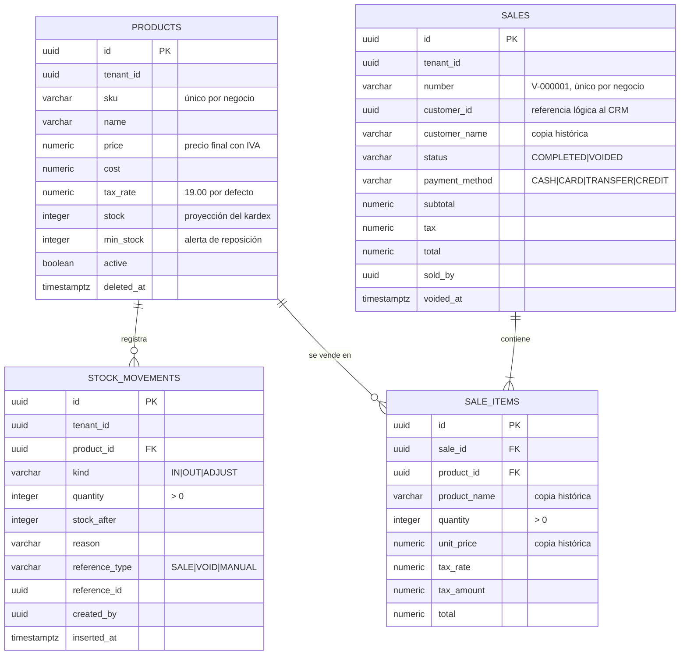

# 02 — Modelo de datos

Kubo aplica **una base de datos por servicio**: ningún servicio consulta el
esquema de otro. Las referencias entre dominios son identificadores lógicos, no
llaves foráneas.

## 1. Panorama



## 2. `kubo_iam` — identidad y auditoría



**Decisiones del modelo**

- `refresh_tokens.token_hash`: si la base se filtra, los tokens no se pueden
  reutilizar (solo se guarda su SHA-256).
- `replaced_by`: al rotar un token se enlaza con el que lo reemplaza. Si vuelve a
  usarse uno revocado, se invalida toda la familia (detección de robo).
- `audit_logs.prev_hash` + `hash`: cada registro encadena el anterior; alterar un
  registro intermedio rompe la cadena y es detectable.
- `users.email` es único **por negocio**, no global.

## 3. `kubo_crm` — clientes con datos personales cifrados

```
customers
├── id                        uuid  PK
├── tenant_id                 uuid  (aislamiento por negocio)
├── name                      varchar(160)
├── email                     varchar(180)
├── document_number_encrypted text      ← AES-256-GCM: base64(iv ‖ tag ‖ ciphertext)
├── document_number_bidx      varchar(64) ← HMAC-SHA256 normalizado (búsqueda exacta)
├── phone_encrypted           text      ← AES-256-GCM
├── phone_bidx                varchar(64) ← HMAC-SHA256
├── city, address, notes
├── stage                     LEAD | PROSPECT | CUSTOMER
├── credit_limit              numeric(14,2)  ≥ 0
├── deleted_at                timestamptz    (borrado lógico)
└── created_at / updated_at
```

**Índices y restricciones**

| Objeto | Propósito |
| --- | --- |
| `idx_customers_tenant_document_unique` (único, parcial) | Un documento no puede repetirse dentro del mismo negocio; ignora borrados |
| `idx_customers_tenant_stage` | Filtros del tablero por etapa |
| `customers_stage_check` | Solo los tres estados previstos |
| `customers_credit_limit_check` | El cupo no puede ser negativo |

## 4. `kubo_erp` — catálogo, inventario y ventas



**Reglas de integridad en el motor**

| Restricción | Qué garantiza |
| --- | --- |
| `products_stock_not_negative` | El motor rechaza stock negativo aunque el código falle |
| `stock_movements_reference_unique` (único parcial) | Una venta no puede descontar dos veces el mismo producto (idempotencia) |
| `sale_items_quantity_positive` | No existen líneas con cantidad cero o negativa |
| `sales_total_not_negative` | No existen ventas con total negativo |
| `products_tenant_sku_unique` (único parcial) | Un SKU no se repite dentro del negocio |

**Por qué el stock es una proyección**: la verdad está en `stock_movements`.
`products.stock` se mantiene por velocidad de lectura y se actualiza **dentro de
la misma transacción** que inserta el movimiento, con el producto bloqueado
(`SELECT ... FOR UPDATE`). Ante cualquier duda se puede reconstruir el saldo
sumando el kardex y compararlo con la proyección.

## 5. `kubo_analytics` — modelo de lectura en MongoDB

```
events (bitácora cruda)
├── _id           = event_id del evento  ← índice único: deduplicación
├── event_type    "sale.created"
├── version       1
├── tenant_id
├── occurred_at   date
├── payload       documento original completo
└── received_at   date

sales (proyección consultable)
├── _id            ObjectId
├── sale_id        índice único
├── tenant_id      + sold_at  (índice compuesto)
├── number, status, payment_method
├── customer_id, customer_name
├── subtotal, tax, total        (double: analítica, no contabilidad)
├── items[]        {product_id, product_name, quantity, unit_price, tax_amount, total}
├── sold_at, created_at, updated_at
```

**Idempotencia**: `events._id` es el `event_id`. Si el mismo evento llega dos
veces, la segunda inserción falla con clave duplicada y se descarta: una venta
nunca se cuenta dos veces.

**Precisión numérica**: el sistema de registro contable es `kubo-erp`, con
aritmética decimal. Aquí los importes se guardan como punto flotante porque las
agregaciones sobre miles de documentos no necesitan precisión de centavo y así
se aprovechan los operadores nativos de MongoDB. Es una decisión consciente: el
tablero es para decidir, la factura es para cobrar.

## 6. Convenciones transversales

| Convención | Decisión |
| --- | --- |
| Identificadores | UUID (v4) en todas las tablas; nunca enteros autoincrementales expuestos |
| Fechas | `timestamptz` en PostgreSQL, almacenadas en UTC; la interfaz muestra `America/Bogota` |
| Dinero | `numeric(14,2)` y aritmética decimal en el ERP; nunca coma flotante |
| Borrado | Lógico (`deleted_at`), nunca físico: la historia comercial se conserva |
| Aislamiento | `tenant_id` en toda tabla de negocio + política RLS escrita y lista para activar |
| Migraciones | Versionadas y **inmutables** una vez aplicadas; nunca se edita una migración ya ejecutada |
