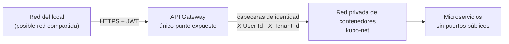

# 04 — Seguridad

Kubo maneja datos personales de clientes, precios de compra y cartera: la
seguridad no es un añadido, es parte del diseño. Este documento explica **qué se
implementó, cómo se verifica y qué queda pendiente**.

## 1. Modelo de confianza



- Solo el gateway (9080) y la PWA (3000) se publican. Los servicios 9081–9084
  solo se mapean al host para diagnóstico local; **en producción no se publican**.
- La identidad se establece **una sola vez**, en el gateway. Los servicios
  internos confían en las cabeceras porque no son alcanzables desde fuera.
- El gateway **elimina cualquier cabecera `X-User-*` que envíe el cliente**
  antes de inyectar la identidad verificada: sin esto, cualquiera podría
  suplantar a otro usuario con un `curl`.

## 2. Autenticación

| Control | Implementación |
| --- | --- |
| Contraseñas | **BCrypt** (coste 10). Nunca se persisten ni se registran en logs |
| Access token | **JWT RS256**, 15 minutos, con `iss`, `aud`, `jti`, `exp` y claims de negocio (`tenant_id`, `role`) |
| Verificación | Solo el gateway, contra el **JWKS** del servicio de identidad, con caché y refresco automático |
| Refresh token | Valor aleatorio de 384 bits; se guarda **solo su SHA-256** |
| Rotación | Cada refresh emite uno nuevo y revoca el anterior |
| Detección de reuso | Si se usa un token ya rotado, se **invalida toda la familia** del usuario y se audita `REFRESH_REUSE_DETECTED` |
| Cierre de sesión | Revoca el refresh token en el servidor, no solo en el navegador |
| Almacenamiento del refresh | **Cookie `httpOnly` + `SameSite=Strict`** emitida por el gateway (BFF); el cuerpo de la respuesta nunca lo incluye |
| Bloqueo de cuenta | Tras 5 intentos fallidos la cuenta se bloquea 15 minutos; el acceso correcto o la recuperación lo levantan |
| Recuperación de contraseña | Enlace de un solo uso, hasheado en base, vence en 30 minutos; al usarse revoca todas las sesiones |

**Por qué asimétrico**: con un secreto compartido, comprometer cualquier servicio
permitiría *emitir* tokens válidos para cualquier usuario. Con RS256, la llave
privada vive solo en `kubo-iam`.

## 3. Cifrado

| Ámbito | Mecanismo | Dónde se verifica |
| --- | --- | --- |
| En tránsito (externo) | TLS terminado en Caddy (`kubo-tls`, puertos 3080/3443) con HSTS y redirección de HTTP | `make smoke` bloque 10 · `05-despliegue.md` §3 |
| En tránsito (interno) | Red privada de contenedores; mTLS previsto para clúster | — |
| **Datos personales** | **AES-256-GCM** campo a campo (documento, teléfono) | `make smoke` inspecciona el texto cifrado en PostgreSQL |
| Búsqueda sobre cifrado | **Índice ciego** HMAC-SHA256 normalizado | `make smoke` verifica que el índice no contiene el valor |
| Contraseñas | BCrypt con sal por usuario | — |
| Respaldos | Cifrado con `age` antes de salir del servidor | Implementado: `make backup` / `make restore-drill` |

Formato almacenado: `base64(iv ‖ tag ‖ ciphertext)`. El **tag de GCM** hace que
cualquier manipulación del texto cifrado sea detectable: el descifrado falla y el
servicio devuelve `null` en lugar de un valor corrupto.

### Gestión de claves

- Las claves llegan por variable de entorno y **nunca** están en el repositorio
  (`.env` está en `.gitignore`; solo se versiona `.env.example` con ceros).
- `KUBO_FIELD_ENCRYPTION_KEY` y `KUBO_BLIND_INDEX_KEY` son de 32 bytes en hex;
  el servicio **falla al arrancar** si no cumplen el formato, en lugar de cifrar
  con una clave débil.
- El servicio **rechaza explícitamente las claves de ejemplo** de `.env.example`:
  desplegar copiando la plantilla sin generar claves produce un error claro
  (`«conserva el valor de ejemplo; genere una clave real»`) en vez de proteger
  los datos con una clave conocida por cualquiera. Cubierto por dos pruebas
  unitarias.
- La llave de firma JWT puede llegar como PEM; si no, el servicio genera un par
  **efímero** en memoria y lo advierte en los logs (solo desarrollo).
- **Pendiente**: envoltura KEK/DEK por negocio con KMS para la versión en nube, y
  rotación de claves de campo (exige re-cifrado por lotes).

## 4. Aislamiento entre negocios

1. Toda tabla de negocio lleva `tenant_id` y toda consulta lo filtra.
2. El `tenant_id` **nunca** viene del cuerpo ni de un parámetro: se toma del
   claim del JWT, que el gateway propaga como cabecera.
3. **RLS activo con `FORCE` en las tres bases** (P-02, ADR-0010). Cada petición
   abre una transacción y fija `app.tenant_id` con `set_config(..., true)`; sin
   contexto, una consulta devuelve **cero filas**. Las operaciones que cruzan
   negocios por diseño (autenticación por correo, cadena de auditoría, semilla,
   respuesta a incidentes) usan la marca `app.system`, deliberada y acotada.
4. **Verificación automática**: `make smoke` comprueba que sin contexto no hay
   filas y con contexto sí, en IAM, CRM y ERP, además de registrar un segundo
   negocio y comprobar que no ve ni un cliente ni un producto del primero.

## 5. Autorización

Roles definidos: `OWNER`, `ADMIN`, `SELLER`, `ACCOUNTANT`, `VIEWER`. El rol viaja
en el token y el gateway lo propaga; cada servicio decide qué permite. En el MVP
el control es por rol y negocio (no hay permisos finos por recurso), lo que se
documenta como alcance.

## 6. Auditoría

`kubo-iam` mantiene `audit_logs` **append-only con cadena de hash**: cada registro
incluye el hash del anterior, de modo que alterar o borrar un registro intermedio
rompe la cadena y es detectable. Se auditan, entre otros: registro de negocio,
inicio de sesión correcto y fallido, rotación de token, reuso detectado.

**Serialización de la cadena**: leer el último hash e insertar el nuevo debe ser
atómico. Sin un bloqueo, dos peticiones concurrentes leerían el mismo hash anterior
y la cadena quedaría partida en dos ramas, lo que haría indetectable una
manipulación posterior. `AuditService` toma un `pg_advisory_xact_lock` al inicio de
la transacción: se libera solo al terminar y no bloquea ninguna tabla.

Los logs son **JSON estructurados** y el gateway **redacta la cabecera
`Authorization`** y las cookies. Nunca se registran contraseñas, tokens ni datos
personales: Rails filtra `document_number`, `phone` y `email` en sus logs.

## 7. Protección de la interfaz y la API

| Amenaza | Mitigación |
| --- | --- |
| Fuerza bruta de contraseñas | Límite de 40 peticiones/minuto en rutas de autenticación + auditoría de intentos fallidos |
| Abuso de la API | Límite de 600 peticiones/minuto por negocio o IP |
| XSS | React escapa por defecto; no se usa `dangerouslySetInnerHTML`; cabeceras de seguridad con Helmet |
| Clickjacking | `X-Frame-Options` de Helmet |
| MIME sniffing | `X-Content-Type-Options: nosniff` |
| Inyección SQL | Consultas parametrizadas en los cuatro lenguajes (JPA, ActiveRecord, Ecto, PyMongo); **no hay SQL concatenado** |
| Inyección en búsquedas | Los comodines `%` y `_` se eliminan del término de búsqueda |
| CSRF | La API no usa cookies de sesión: la autenticación es por cabecera `Authorization` |
| Enumeración de usuarios | El login responde el mismo mensaje para correo inexistente y contraseña incorrecta |
| Fuga de datos entre negocios | Aislamiento por `tenant_id` + prueba automática |

### Sobre el almacenamiento del refresh token

El refresh token **no toca el navegador**: el gateway (BFF) lo recibe del IAM y lo
deja en una cookie `httpOnly` + `SameSite=Strict` con `Path=/api/v1/auth`, y lo
elimina del cuerpo de la respuesta (P-03, verificado en el humo). El access token
(15 minutos) vive solo en memoria. El refresh rota en cada uso y el reuso se
detecta invalidando la familia completa: el humo comprueba que, tras un reuso, ni
la cookie rotada sigue sirviendo. En producción con HTTPS, `KUBO_COOKIE_SECURE=true`
marca además la cookie como `Secure`.

## 8. Cumplimiento normativo

| Norma | Cómo se aborda |
| --- | --- |
| **Ley 1581 de 2012** (protección de datos personales, Colombia) | Cifrado de datos personales, minimización (enmascarado en listados), borrado lógico reversible, trazabilidad de accesos. **Pendiente**: registro de autorizaciones del titular, política de retención y procedimiento de supresión definitiva |
| **Facturación electrónica DIAN** | Fuera del alcance del MVP (requiere ser Proveedor Tecnológico autorizado). El dominio deja preparado el puerto de facturación para emitir UBL 2.1 con CUFE y QR en la Fase 4 (P-18) |
| **Habeas data en la interfaz** | El manual de usuario documenta qué datos se guardan, para qué y cómo se solicitan al cliente |

## 9. Verificación

```bash
make smoke
```

La prueba de humo comprueba, entre otras cosas:

- Petición sin token → `401`.
- Token con firma falsificada → `401`.
- Cabecera `X-User-Id` inyectada por el cliente → **ignorada** (`401`).
- Documento cifrado en PostgreSQL y legible solo por el detalle autorizado.
- Listado con el documento enmascarado.
- Índice ciego sin el valor en claro.
- Segundo negocio que no ve datos del primero.

## 10. Pendientes de seguridad

| Pendiente | ID · Fase | Riesgo que cierra |
| --- | --- | --- |
| Segundo factor (TOTP) para el propietario | P-30 · Fase 4 | Robo de credenciales |
| mTLS entre gateway y servicios | P-28 · Fase 5 | Movimiento lateral dentro del clúster |
| Rotación de claves de cifrado de campo | P-29 · Fase 5 | Compromiso de una clave a largo plazo |

> **Resueltos**: en la Fase 1, cookie `httpOnly` (P-03), RLS activo (P-02) y
> límite de tasa por usuario (P-31); en la Fase 2, SAST/escaneo de secretos y
> dependencias en CI (P-06) y contratos ejecutables (P-09). Ver
> [`11-plan-de-cierre.md`](11-plan-de-cierre.md).
