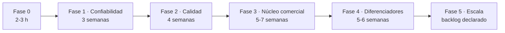

# 11 — Plan de cierre

| Campo | Valor |
| --- | --- |
| Fecha | 2026-09-23 |
| Objetivo | Producto comercializable en la región (Fases 0–4); la Fase 5 queda como backlog declarado |
| Punto de partida | 44/44 comprobaciones en verde · 10 contenedores sanos · 9 repositorios limpios |
| Dedicación | ~30 h/semana (≈ 3.75 jornadas de 8 h) |
| Estado | Fase 0 completada · Fases 1–4 planificadas · Fase 5 declarada |

Este documento ordena los 31 pendientes de [`10-auditoria.md`](10-auditoria.md) en
fases con criterio de cierre medible. No sustituye a la auditoría: la usa como
catálogo de origen.

## 1. Decisiones registradas

| Decisión | Elección |
| --- | --- |
| Objetivo del cierre | Producto comercializable (Fases 0–4; Fase 5 como backlog declarado) |
| Primer módulo de la Fase 3 | Compras + Caja |
| Dedicación | ~30 h/semana |

## 2. Hallazgos de la revisión de cierre (R-1…R-9)

La revisión que originó este plan encontró nueve inconsistencias. Todas quedaron
corregidas en la Fase 0 o asignadas a una fase con ID.

| ID | Hallazgo | Resolución | Estado |
| --- | --- | --- | --- |
| R-1 | IDs de hallazgos duplicados en la auditoría (las dos rondas colisionaron: cuatro secciones A-04/A-05) | Renumerados a **A-06** y **A-09** en §4 | Corregido |
| R-2 | La importación de datos (Excel/CSV/Dolibarr) no estaba en ningún plan | **P-24** · Fase 3 | Planificado |
| R-3 | El quinto servicio figuraba como «planificado» en trazabilidad pero sin fase | **P-25** Documentos + **P-19** Notificaciones · Fase 4 | Planificado |
| R-4 | Faltaban los ADR 0009–0012 que la propia auditoría exige | 0009 y 0010 · Fase 1 · 0011 · Fase 2 · 0012 · Fase 4 | Planificado |
| R-5 | La auditoría de accesibilidad (axe) estaba en pruebas pendientes sin ID | **P-26** · Fase 2 | Planificado |
| R-6 | TLS/HTTPS solo estaba en la guía de despliegue, no en el plan | **P-27** · Fase 1 | Planificado |
| R-7 | RLS versionada solo en `kubo-iam`, contra lo que afirmaba `04-seguridad.md` §4.3 | Script para CRM y ERP dentro de **P-02** · Fase 1 | Planificado |
| R-8 | Pendientes de `04-seguridad.md` §10 sin ID ni fase (mTLS, rotación de claves, 2FA, rate limiting por usuario) | **P-28…P-31** con fase asignada | Planificado |
| R-9 | Conteos y referencias de fase desactualizados (8/9 contenedores, 37 comprobaciones, «16 pendientes») | Corregidos en `01`, `04`, `05`, `07`, `08`, `09` y `10` | Corregido |

## 3. Fases

### Fase 0 — Consistencia (completada, 2–3 h)

| Paso | Acción | Estado |
| --- | --- | --- |
| F0.1 | Renumerar los A-04/A-05 duplicados (A-06, A-09) | Hecho |
| F0.2 | Corregir conteos y la afirmación de RLS | Hecho |
| F0.3 | Incorporar P-24…P-31 con ID y fase | Hecho |
| F0.4 | Renumerar fases 0–5 en todos los documentos y ADR | Hecho |
| F0.5 | Crear este documento, enlazarlo, añadirlo al PDF y commit | Hecho |

**Criterio**: el resumen y el detalle de la auditoría coinciden y el plan es
navegable desde el índice.

### Fase 1 — Confiabilidad (≈3 semanas) — bloqueante para un negocio real

| Paso | Pendiente | ID | Esfuerzo |
| --- | --- | --- | --- |
| F1.1 | Outbox transaccional + publicador de barrido + ADR-0009 | P-01 | 1–2 d |
| F1.2 | Interceptor de tenant + RLS en las tres bases (escribir el script en CRM y ERP) + ADR-0010 | P-02 · R-7 | 2–3 d |
| F1.3 | Refresh token en cookie `httpOnly` + `SameSite` (BFF) | P-03 | 2 d |
| F1.4 | Recuperación de contraseña por correo | P-04 | 1 d |
| F1.5 | Respaldos automatizados + simulacro cronometrado | P-05 | 1 d |
| F1.6 | Bloqueo de cuenta tras N intentos fallidos | P-11 | 0.5 d |
| F1.7 | Límite de tasa por usuario | P-31 | 0.5 d |
| F1.8 | Versionado del algoritmo de hash de auditoría (`hash_version`) | P-23 | 1 d |
| F1.9 | TLS en la instalación (Caddy + verificación en el humo) | P-27 | 1 d |

**Criterio de aceptación**: prueba de caída del bus sin pérdida de eventos · una
consulta sin filtro de tenant devuelve cero filas · restauración completa
cronometrada por debajo de 4 h · `make smoke` con ≥ 55 comprobaciones en verde.

### Fase 2 — Calidad y observabilidad (≈4 semanas)

| Paso | Pendiente | ID | Esfuerzo |
| --- | --- | --- | --- |
| F2.1 | CI por repositorio (lint, pruebas, SAST, secretos, SBOM) + ADR-0011 | P-06 | 2–3 d |
| F2.2 | OpenTelemetry en los cuatro lenguajes → Grafana/Loki/Tempo | P-07 | 3 d |
| F2.3 | Pruebas de integración con Testcontainers | P-08 | 3 d |
| F2.4 | Contratos ejecutables (OpenAPI/Pact) | P-09 | 2 d |
| F2.5 | E2E (Playwright) + carga (k6, 50 cajas) | P-10 | 2 d |
| F2.6 | Caché del service worker por usuario + axe en CI | P-12 · P-26 | 1 d |
| F2.7 | Paginación en productos, ventas y movimientos + digests de imagen | P-13 · P-14 | 1.5 d |

**Criterio de aceptación**: una regresión de seguridad o de contrato bloquea el
merge · p95 del POS por debajo de 300 ms con 50 cajas · cobertura de dominio ≥ 80 %.

### Fase 3 — Núcleo comercial (5–7 semanas) — orden aprobado: Compras + Caja

| Paso | Pendiente | ID | Esfuerzo |
| --- | --- | --- | --- |
| F3.1 | Compras y proveedores | P-15 | 5–7 d |
| F3.2 | Sesiones de caja (apertura, cierre, arqueo) | P-16 | 5–7 d |
| F3.3 | Usuarios y roles en la interfaz | P-20 | 3–4 d |
| F3.4 | Importación de datos (Excel/CSV; ruta Dolibarr) | P-24 | 3–4 d |
| F3.5 | Reportes exportables + comprobante de venta imprimible | P-21 | 3–4 d |

**Criterio de aceptación**: un negocio carga su catálogo desde Excel, abre caja,
vende, imprime el comprobante y cierra el turno con arqueo cuadrado.

### Fase 4 — Diferenciadores (5–6 semanas)

| Paso | Pendiente | ID | Esfuerzo |
| --- | --- | --- | --- |
| F4.1 | Vertical Packs (retail, servicios, restaurantes, agro) | P-17 | 4–6 d |
| F4.2 | Facturación electrónica DIAN (UBL 2.1, CUFE, QR) como puerto enchufable | P-18 | 4–6 d |
| F4.3 | Notificaciones (WhatsApp/correo) + servicio de Documentos | P-19 · P-25 | 4–6 d |
| F4.4 | Multi-bodega y transferencias | P-22 | 2–3 d |
| F4.5 | Segundo factor (TOTP) del propietario | P-30 | 1–2 d |
| F4.6 | ADR-0012: zona horaria por negocio en la tabla `tenants` | — | 0.5 d |

**Criterio de aceptación**: dos verticales activables sin tocar el núcleo · factura
DIAN emitida en ambiente de habilitación · notificación real entregada ·
transferencia entre dos bodegas con kardex en ambas.

### Fase 5 — Escala (backlog declarado)

| ID | Línea de trabajo |
| --- | --- |
| P-28 | mTLS entre gateway y servicios |
| P-29 | Rotación de claves de cifrado de campo (KEK/DEK) |
| — | Instalación remota (Terraform/Ansible) |
| — | Multi-tenant SaaS (onboarding y zona horaria por negocio) |
| — | App móvil nativa y operador de respaldos |

## 4. Camino crítico y calendario

| Hito | Duración | Semanas acumuladas |
| --- | --- | --- |
| Fase 0 | 2–3 h | día 1 |
| Fase 1 | ≈3 semanas | 1–3 |
| Fase 2 | ≈4 semanas | 4–7 |
| Fase 3 | 5–7 semanas | 8–14 |
| Fase 4 | 5–6 semanas | 15–20 |
| **Producto comercializable** | **≈17–20 semanas** | **~4–5 meses a 30 h/semana** |

## 5. Definición de «proyecto terminado»

1. Un negocio real opera una semana completa sin soporte presencial.
2. Cero pérdida de datos: caída del bus, del proceso o del equipo → nada se
   pierde (outbox + respaldos probados).
3. Aislamiento garantizado por el motor, no por el programador (RLS activo).
4. Una regresión no llega a `main`: CI con gates de seguridad y de contrato.
5. Los 5 módulos que el negocio pide (compras, caja, usuarios, comprobantes,
   reportes) funcionando en la PWA.
6. Documentación viva: cada decisión con su ADR, cada requisito con su prueba.

## 6. Riesgos y dependencias

| Riesgo | Mitigación |
| --- | --- |
| Push a GitLab bloqueado (falta Personal Access Token) | `GITLAB_TOKEN=... make push`; los commits quedan locales mientras tanto |
| Las pruebas del ERP no corren en el contenedor de producción (OOM con 512 MB) | Comando con `-m 3g` documentado en `07-pruebas.md`; el CI de la Fase 2 las ejecuta |
| DIAN exige ser Proveedor Tecnológico autorizado | Trámite externo; la Fase 4 avanza con el puerto y deja la habilitación como cierre |
| Capturas internas de la app y video demo pendientes | Guía en `evidencia/README.md` y guion en `09-demo-guion.md`; tarea del usuario |
| La Fase 3 no debe empezar sin la Fase 1 | Orden por riesgo: no se construye producto sobre una entrega de eventos no garantizada |

## 7. Catálogo de pendientes

El catálogo completo con IDs, riesgo y esfuerzo vive en
[`10-auditoria.md` §5](10-auditoria.md); este documento lo ordena por fase y fija
el criterio de cierre de cada una.
