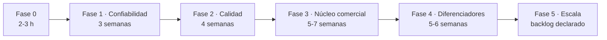

# 11 — Plan de cierre

| Campo | Valor |
| --- | --- |
| Fecha | 2026-09-23 |
| Objetivo | Producto comercializable en la región (Fases 0–4); la Fase 5 queda como backlog declarado |
| Punto de partida | 44/44 comprobaciones en verde · 10 contenedores sanos · 9 repositorios limpios |
| Dedicación | ~30 h/semana (≈ 3.75 jornadas de 8 h) |
| Estado | Fases 0–3 completadas · Fase 4 en curso (F4.6 completado) · Fase 5 como backlog declarado |

Este documento ordena los 31 pendientes de [`10-auditoria.md`](10-auditoria.md) en
fases con criterio de cierre medible. No sustituye a la auditoría: la usa como
catálogo de origen.

## 1. Decisiones registradas

| Decisión | Elección |
| --- | --- |
| Objetivo del cierre | Producto comercializable (Fases 0–4; Fase 5 como backlog declarado) |
| Primer módulo de la Fase 3 | Compras + Caja |
| Dedicación | ~30 h/semana |

## 2. Hallazgos de la revisión de cierre (R-1…R-9)

La revisión que originó este plan encontró nueve inconsistencias. Todas quedaron
corregidas en la Fase 0 o asignadas a una fase con ID.

| ID | Hallazgo | Resolución | Estado |
| --- | --- | --- | --- |
| R-1 | IDs de hallazgos duplicados en la auditoría (las dos rondas colisionaron: cuatro secciones A-04/A-05) | Renumerados a **A-06** y **A-09** en §4 | Corregido |
| R-2 | La importación de datos (Excel/CSV/Dolibarr) no estaba en ningún plan | **P-24** · Fase 3 | Planificado |
| R-3 | El quinto servicio figuraba como «planificado» en trazabilidad pero sin fase | **P-25** Documentos + **P-19** Notificaciones · Fase 4 | Planificado |
| R-4 | Faltaban los ADR 0009–0012 que la propia auditoría exige | 0009 y 0010 · Fase 1 · 0011 · Fase 2 · 0012 · Fase 4 | Planificado |
| R-5 | La auditoría de accesibilidad (axe) estaba en pruebas pendientes sin ID | **P-26** · Fase 2 | Planificado |
| R-6 | TLS/HTTPS solo estaba en la guía de despliegue, no en el plan | **P-27** · Fase 1 | Planificado |
| R-7 | RLS versionada solo en `kubo-iam`, contra lo que afirmaba `04-seguridad.md` §4.3 | Script para CRM y ERP dentro de **P-02** · Fase 1 | Planificado |
| R-8 | Pendientes de `04-seguridad.md` §10 sin ID ni fase (mTLS, rotación de claves, 2FA, rate limiting por usuario) | **P-28…P-31** con fase asignada | Planificado |
| R-9 | Conteos y referencias de fase desactualizados (8/9 contenedores, 37 comprobaciones, «16 pendientes») | Corregidos en `01`, `04`, `05`, `07`, `08`, `09` y `10` | Corregido |

## 3. Fases

### Fase 0 — Consistencia (completada, 2–3 h)

| Paso | Acción | Estado |
| --- | --- | --- |
| F0.1 | Renumerar los A-04/A-05 duplicados (A-06, A-09) | Hecho |
| F0.2 | Corregir conteos y la afirmación de RLS | Hecho |
| F0.3 | Incorporar P-24…P-31 con ID y fase | Hecho |
| F0.4 | Renumerar fases 0–5 en todos los documentos y ADR | Hecho |
| F0.5 | Crear este documento, enlazarlo, añadirlo al PDF y commit | Hecho |

**Criterio**: el resumen y el detalle de la auditoría coinciden y el plan es
navegable desde el índice.

### Fase 1 — Confiabilidad (≈3 semanas) — bloqueante para un negocio real

| Paso | Pendiente | ID | Esfuerzo |
| --- | --- | --- | --- |
| F1.1 | Outbox transaccional + publicador de barrido + ADR-0009 | P-01 | 1–2 d |
| F1.2 | Interceptor de tenant + RLS en las tres bases (escribir el script en CRM y ERP) + ADR-0010 | P-02 · R-7 | 2–3 d |
| F1.3 | Refresh token en cookie `httpOnly` + `SameSite` (BFF) | P-03 | 2 d |
| F1.4 | Recuperación de contraseña por correo | P-04 | 1 d |
| F1.5 | Respaldos automatizados + simulacro cronometrado | P-05 | 1 d |
| F1.6 | Bloqueo de cuenta tras N intentos fallidos | P-11 | 0.5 d |
| F1.7 | Límite de tasa por usuario | P-31 | 0.5 d |
| F1.8 | Versionado del algoritmo de hash de auditoría (`hash_version`) | P-23 | 1 d |
| F1.9 | TLS en la instalación (Caddy + verificación en el humo) | P-27 | 1 d |

**Criterio de aceptación**: prueba de caída del bus sin pérdida de eventos · una
consulta sin filtro de tenant devuelve cero filas · restauración completa
cronometrada por debajo de 4 h · `make smoke` con ≥ 55 comprobaciones en verde.

**Estado: completada (2026-09-24).** Evidencia: `make smoke` **73/73** ·
`make bus-drill` **4/4** (venta con el bus caído, evento `PENDING`, publicación al
volver) · `make restore-drill` **14/14** con RTO de 6 s · consulta sin contexto =
**0 filas** en IAM, CRM y ERP · ADR-0009 y ADR-0010 aceptados.

Dos defectos reales aparecieron al integrar la fase y quedaron corregidos:

1. **RLS en transacciones `REQUIRES_NEW`**: el contador de intentos fallidos y la
   revocación de la familia de tokens corrían en otra conexión sin contexto y
   actualizaban cero filas en silencio (el sistema detectaba el robo y no cerraba
   nada). `SecurityIncidentService` ahora fija su propia marca de sistema, y el
   humo comprueba la revocación completa de la familia.
2. **Transacciones anidadas de Ecto sin savepoint**: un `Repo.rollback` de negocio
   (stock insuficiente) abortaba la transacción externa del interceptor y tumbaba
   la petición después de responder. `Repo.scoped_transaction/1` usa savepoints.
   En el mismo paso se corrigió un contrato roto del ERP: `Catalog.adjust_stock`
   devolvía `{:ok, {product, movement}}` y el controlador esperaba
   `{:ok, product, movement}` (el ajuste de inventario respondía 500).

### Fase 2 — Calidad y observabilidad (≈4 semanas)

| Paso | Pendiente | ID | Esfuerzo |
| --- | --- | --- | --- |
| F2.1 | CI por repositorio (lint, pruebas, SAST, secretos, SBOM) + ADR-0011 | P-06 | 2–3 d |
| F2.2 | OpenTelemetry en los cuatro lenguajes → Grafana/Loki/Tempo | P-07 | 3 d |
| F2.3 | Pruebas de integración con Testcontainers | P-08 | 3 d |
| F2.4 | Contratos ejecutables (OpenAPI/Pact) | P-09 | 2 d |
| F2.5 | E2E (Playwright) + carga (k6, 50 cajas) | P-10 | 2 d |
| F2.6 | Caché del service worker por usuario + axe en CI | P-12 · P-26 | 1 d |
| F2.7 | Paginación en productos, ventas y movimientos + digests de imagen | P-13 · P-14 | 1.5 d |

**Criterio de aceptación**: una regresión de seguridad o de contrato bloquea el
merge · p95 del POS por debajo de 300 ms con 50 cajas · cobertura de dominio ≥ 80 %.

**Estado: completada (2026-09-24).** Evidencia:

- **P-06 CI**: `.gitlab-ci.yml` en los ocho repositorios (pruebas, SAST, secretos,
  dependencias) y gate local `make ci` → **9/9 en verde** (secretos, suites,
  contratos, humo, E2E).
- **P-07 OpenTelemetry**: collector OTLP propio (`kubo-otel`) y los **cinco
  servicios exportando trazas** (gateway, IAM, CRM, ERP y analítica), con
  `make observability` para el stack visual (Tempo + Grafana). El humo verifica
  que el collector recibe trazas.
- **P-09 contratos**: `kubo-docs/api/openapi.json` + `make contracts` →
  **10/10 contratos** validados con Ajv contra la API viva.
- **P-10 carga y E2E**: `make load` (50 cajas) → **100 % de ventas exitosas,
  p95 = 149.76 ms**; Playwright + axe → **4/4**, con tres defectos reales de
  accesibilidad corregidos (contraste y un `select` sin nombre accesible).
- **P-12 · P-13 · P-14 · P-26**: caché por sesión, paginación real con totales
  (los listados mentían en `total`), digests de imágenes y axe en CI.
- **Cobertura**: IAM **85.5 %** de dominio (gate JaCoCo ≥ 80 % en `mvn verify`)
  y analítica **91 %** en su módulo de dominio (gate `--cov-fail-under=80`).
- **P-08 integración con infraestructura real**: en los cinco servicios, contra
  el motor y no contra dobles. IAM: RLS + cadena de auditoría sobre PostgreSQL
  (2 pruebas). Analítica: deduplicación y proyección sobre MongoDB efímero
  (testcontainers, 2 pruebas). ERP: RLS sin contexto = 0 filas, numeración
  consecutiva por negocio, atomicidad venta + bandeja de salida y kardex con
  anulación sobre PostgreSQL real (4 pruebas). CRM: aislamiento RLS entre
  negocios y round-trip del cifrado con índice ciego sobre PostgreSQL real
  (2 pruebas). Gateway: ventana de límite de tasa, 429 al exceder y cuota
  independiente por usuario contra Redis real (3 pruebas). En todos, las
  pruebas corren como el **rol de la aplicación**, no como superusuario: un
  superusuario ignora RLS incluso con `FORCE` y la prueba dejaría de probar
  algo. Los runners son `kubo-infra/scripts/erp-tests.sh`, `crm-tests.sh` y
  `analytics-tests.sh` (integrados en `make ci`), y cada `.gitlab-ci.yml` añade
  el servicio correspondiente (postgres/redis).
- **Defectos reales corregidos al añadir P-08**: el CI de analítica no podía
  importar `app` (faltaba `pytest.ini` con `pythonpath`) ni tenía instalado
  `pytest-cov` pese a usar `--cov-fail-under`; el guard de las pruebas de
  integración exigía el binario `docker` cuando basta el socket; y el volcado de
  `schema.rb` rompía las migraciones del CRM en el contenedor de pruebas.

Defectos reales corregidos durante la fase (además de los de implementación):
numeración de ventas con `ON CONFLICT` que devolvía un id inexistente, RLS con
subconsulta inestable bajo concurrencia (denormalizado `tenant_id` en
`sale_items`), interceptor de tenant con `Repo.rollback` fuera de transacción
real, y la cobertura de listados que reportaba el tamaño de página como total.

### Fase 3 — Núcleo comercial (5–7 semanas) — orden aprobado: Compras + Caja

| Paso | Pendiente | ID | Esfuerzo |
| --- | --- | --- | --- |
| F3.1 | Compras y proveedores | P-15 | 5–7 d |
| F3.2 | Sesiones de caja (apertura, cierre, arqueo) | P-16 | 5–7 d |
| F3.3 | Usuarios y roles en la interfaz | P-20 | 3–4 d |
| F3.4 | Importación de datos (Excel/CSV; ruta Dolibarr) | P-24 | 3–4 d |
| F3.5 | Reportes exportables + comprobante de venta imprimible | P-21 | 3–4 d |

**Criterio de aceptación**: un negocio carga su catálogo desde Excel, abre caja,
vende, imprime el comprobante y cierra el turno con arqueo cuadrado.

**Estado: completada (2026-09-24).** Los cinco pasos quedaron construidos y
verificados:

- **P-15 Compras y proveedores**: dominio completo en el ERP (proveedores con
  borrado lógico, compras con detalle, numeración atómica `C-000001`, RLS en las
  tres tablas nuevas), la compra suma inventario, deja el kardex (`PURCHASE`),
  actualiza el costo del producto **sin IVA** y emite `purchase.received` por la
  bandeja de salida; la anulación revierte el stock (`PURCHASE_VOID`).
- **P-16 Sesiones de caja**: apertura con base, una sola caja abierta por negocio
  (índice único parcial), ventas ligadas al turno, cierre con arqueo (esperado =
  base + efectivo de ventas completas − anuladas) y diferencia calculada.
- **P-20 Usuarios y roles**: correo único global en IAM (índice funcional sobre
  `lower(email)`), creación y edición de usuarios por el propietario
  (`requireAdmin`), cambio de rol, habilitar/deshabilitar con efecto inmediato en
  el ingreso (`USER_DISABLED`).
- **P-24 Importación de catálogo (CSV)**: detección de separador `,`/`;`, alias de
  cabeceras en español e inglés, alta o actualización por SKU, stock por kardex
  (`IMPORT`), errores por línea con número, límite de 1000 filas; en la PWA con
  modal de archivo o texto pegado y resumen de creados/actualizados/errores.
- **P-21 Reportes y comprobante**: `GET /reports/sales.csv` (filtro `from`/`to`
  interpretado en la **zona horaria del negocio**, fechas ISO con offset) y
  `GET /reports/inventory.csv` valorizado; fechas inválidas responden 400. La PWA
  descarga ambos reportes y el POS imprime el comprobante de la última venta sin
  depender de internet.
- **Defecto corregido durante el cierre**: el ERP no traía base de datos de zonas
  horarias (`tzdata`), así que `DateTime.now("America/Bogota")` fallaba y el día
  comercial caía silenciosamente a UTC entre las 19:00 y las 23:59 locales (el
  mismo defecto A-01, latente en otra capa). Se añadió `tzdata`, se registró el
  respaldo y el humo verifica que el filtro de fechas respeta la zona del negocio.
- **Evidencia**: humo **102/102** (12 bloques, repetible en el mismo minuto),
  contratos **12/12**, E2E **4/4** con auditoría axe, `make ci` en verde.

### Fase 4 — Diferenciadores (5–6 semanas)

| Paso | Pendiente | ID | Esfuerzo |
| --- | --- | --- | --- |
| F4.1 | Vertical Packs (retail, servicios, restaurantes, agro) | P-17 | 4–6 d |
| F4.2 | Facturación electrónica DIAN (UBL 2.1, CUFE, QR) como puerto enchufable | P-18 | 4–6 d |
| F4.3 | Notificaciones (WhatsApp/correo) + servicio de Documentos | P-19 · P-25 | 4–6 d |
| F4.4 | Multi-bodega y transferencias | P-22 | 2–3 d |
| F4.5 | Segundo factor (TOTP) del propietario | P-30 | 1–2 d |
| F4.6 | ADR-0012: zona horaria por negocio en la tabla `tenants` | — | 0.5 d |

**Criterio de aceptación**: dos verticales activables sin tocar el núcleo · factura
DIAN emitida en ambiente de habilitación · notificación real entregada ·
transferencia entre dos bodegas con kardex en ambas.

**Estado: en curso (2026-09-24).**

- **F4.6 ADR-0012 · zona horaria por negocio: completado.** `tenants.timezone`
  en IAM (migración `V5`), claim `tenant_timezone` en el token, cabecera
  `x-tenant-timezone` propagada por el gateway (reescrita siempre con el valor
  verificado, nunca la del cliente) y aplicada por el ERP con validación contra
  la base de zonas (400 `INVALID_TIMEZONE` si es desconocida) y respaldo
  configurado. Evidencia: IAM 35 pruebas (claim), gateway 8/8 (cabecera),
  ERP 5/5 de integración (precedencia), humo **109/109** (zona del negocio,
  zona distinta honrada y zona inválida rechazada).
- **F4.1 Vertical Packs (P-17): en curso.** El vertical es un dato del negocio
  (ADR-0013), no una bifurcación del producto:
  - **Catálogo** en el ERP (`KuboErp.Packs`): cuatro verticales —retail,
    servicios, restaurantes y agro— con terminología, IVA por defecto, si
    lleva inventario y flujo de punto de venta; `GET /packs` y
    `GET /packs/current`; un vertical desconocido cae al paquete por defecto
    con aviso (solo afecta etiquetas, no datos).
  - **Negocio**: `tenants.vertical` en IAM (migración `V6`), claim
    `tenant_vertical`, cabecera `x-tenant-vertical` propagada por el gateway y
    `GET/PATCH /tenants/me` (solo propietario o administrador) para activar un
    paquete; el cambio aplica al refrescar la sesión, que la propia interfaz
    dispara al guardar.
  - **PWA**: contexto `usePack` que adapta la terminología (una tienda ve
    «Productos» y un restaurante «Platillos») y pantalla **Configuración** con
    el selector de vertical y la zona horaria.
  - **Evidencia**: IAM **36 pruebas** (claim y validación `INVALID_VERTICAL`),
    gateway **9/9** (cabecera y rutas), ERP puras **16/16** y 5/5 de
    integración, humo **114/114** (catálogo, demo en retail, vertical inválido
    rechazado y cambio reflejado en el token nuevo), E2E **4/4** con la
    pantalla nueva auditada.
  - **Incremento aplicado**: el paquete ya cambia el comportamiento, no solo
    las etiquetas. `products.tracks_stock` (migración `20260923000010`): un
    servicio se vende sin existencias, no mueve kardex al vender y no lo
    devuelve al anular; el POS no bloquea la venta ni avisa de stock, y el
    formulario de productos lo propone según el paquete. `sales.table_number`:
    el flujo `pos_flow: "table"` muestra el campo de mesa en el POS, lo guarda
    en la venta y lo imprime en el comprobante. Evidencia: ERP integración
    **6/6** (servicio sin kardex y venta con mesa), humo **117/117**, E2E 4/4.
  - **Siembra del catálogo de arranque**: `POST /packs/apply` crea los
    productos de arranque del paquete activo (tres por vertical, con la
    terminología, el IVA y la bandera de inventario del paquete) y es
    **idempotente**: los SKU existentes se omiten, así que aplicarlo dos veces
    no duplica nada. La pantalla de Configuración lo ofrece con un botón y el
    resultado se informa al usuario. Evidencia: ERP integración **7/7**,
    humo **120/120** (siembra, no duplica y omite existentes).
  - **Criterio de aceptación de F4.1 cubierto**: dos verticales activables sin
    tocar el núcleo (probado con `retail` y `restaurantes` en el humo), con
    terminología, valores por defecto y comportamiento distintos.
- **F4.2 Facturación electrónica DIAN (P-18): puerto implementado.** El núcleo
  no conoce al proveedor: `KuboErp.Billing` es el contrato y el adaptador
  `Sandbox` genera UBL 2.1 con el CUFE del algoritmo DIAN (SHA-384, 96
  hexadecimales), el QR del catálogo y el escapado XML. La factura se persiste
  inmutable (`invoices`, con RLS), emitir es idempotente, una venta anulada no
  se factura (409 `SALE_VOIDED`) y el nombre del emisor llega por
  `x-tenant-name`. Evidencia: ERP puras **20/20** y integración **9/9**, humo
  **125/125**, contratos **16/16** (esquema `InvoiceItem` contra la API viva).
  Pendiente declarado: notas crédito, firma XAdES y registro del NIT y la clave
  técnica ante la DIAN (trámite externo).
- **F4.5 Segundo factor TOTP del propietario (P-30): completado.** El secreto se
  cifra en reposo (AES-256-GCM con `KUBO_TOTP_ENCRYPTION_KEY`; sin llave el
  servicio no arranca), la implementación es propia y verificada contra los
  vectores del RFC 6238, y el acceso se parte en dos: `login` responde un
  desafío firmado con `typ=totp` (el gateway solo acepta `typ=access`) y
  `POST /auth/totp/verify` lo cambia por la sesión. `setup` deja el secreto
  pendiente, `enable` lo confirma con el primer código y `disable` exige un
  código vigente; todo queda auditado. La PWA pide el código en el ingreso y la
  pantalla de Configuración permite configurarlo. Evidencia: IAM **46 pruebas**
  (vectores RFC, cifrado, desafío y ciclo completo), gateway **9/9**, humo
  **130/130** con un código real calculado en Python (implementación
  independiente), E2E 4/4, `make ci` 10/10.
- **F4.3 Notificaciones (P-19): corte implementado.** El aviso es un **puerto**
  (`KuboErp.Notifications`, ADR-0017): el núcleo dice qué pasó y el adaptador
  decide cómo se entrega; el de por defecto escribe en el **buzón del negocio**
  (`notifications`, con RLS), que sirve de demostración, auditoría y base para un
  proveedor real. La notificación viaja en la transacción que la provoca y el
  aviso de stock bajo usa histéresis (avisa al **cruzar** el mínimo, no en cada
  venta). Evidencia: humo **139/139** con el aviso `LOW_STOCK` y las unidades
  restantes. Pendiente del paso: adaptador real de WhatsApp/SMTP con entrega en
  segundo plano, buzón en la PWA, notificaciones de compra/resumen y el servicio
  de Documentos (P-25).
- **F4.4 Multi-bodega y transferencias (P-22): modelo implementado.** El stock
  por bodega es real (`warehouses`, `stock_levels` como fuente de verdad,
  `products.stock` como total denormalizado mantenido en la misma transacción),
  el kardex gana `warehouse_id` con índice de idempotencia por bodega y la
  transferencia es un **par de movimientos atómicos** con las reglas del ADR-0016
  (origen ≠ destino, cantidades positivas, producto con inventario, existencia
  suficiente). La migración hace el backfill de bodega, niveles y kardex
  histórico **antes** de activar RLS, y crea la bodega por defecto de cada
  negocio (las nuevas se crean de forma perezosa). Evidencia: ERP integración
  **10/10** con PostgreSQL real, **humo 137/137** (transferencia, total
  invariante, kardex en ambas bodegas, 409 por existencia y 409 al borrar la
  bodega por defecto) y **contratos 18/18** (`WarehouseList`, `TransferList`).
  El backfill de la migración resultó invisible para RLS (las tablas ya tenían
  `FORCE`): se suspende `FORCE` durante el backfill y se restaura al terminar,
  con backfill idempotente. **Completado con la PWA de bodegas/transferencias y
  la elección de bodega en el POS**: la venta despacha desde la bodega elegida
  (el ERP la valida y descuenta su nivel; una bodega ajena responde 404), con
  humo **146/146** e integración **12/12**.

### Fase 5 — Escala (backlog declarado)

**P-29 · rotación de claves: completado (ADR-0019).** Envelope encryption con
anillo de llaves y formato versionado (`v1:<key_id>:…`): la llave nueva entra al
frente, las viejas siguen descifrando y la rotación es una tarea de sistema por
lotes, idempotente y que **nunca destruye un dato ilegible** (lo cuenta). El
índice ciego se recalcula en el mismo guardado. Evidencia: CRM puras **12/12** e
integración **3/3** con PostgreSQL real. Operación: `rake kubo:rotate_field_keys`
(agregar la llave nueva a `KUBO_FIELD_ENCRYPTION_KEYS`, correr la tarea, retirar
las viejas cuando el resumen diga 0 rotadas).

**P-28 · mTLS entre gateway y servicios: completado (ADR-0020).** Una CA interna
propia (`make certs`, no versionada) firma un certificado por servicio; cada
servicio exige el certificado del cliente (`client-auth: need`, `verify_mode:
peer`, `fail_if_no_peer_cert`) y el gateway es el único cliente de la malla
(agente de `undici` con CA y certificado, compartido por el proxy, el BFF de
autenticación, el tablero y la descarga del JWKS). Los SAN incluyen `localhost`
para que los healthchecks también ejerzan la verificación de nombre. Evidencia:
humo **150/150** (incluye la comprobación negativa: sin certificado no hay
handshake), `make ci` **10/10**. Un contenedor añadido a la red ya no puede
suplantar identidad con cabeceras.

**Instalación remota: playbook de Ansible (`kubo-infra/ansible/`).** Deja el
sistema corriendo en un servidor limpio con **secretos únicos generados en el
host** (bases, RabbitMQ, firma, TOTP y contraseña inicial), la malla cifrada
creada allí y el cortafuegos abriendo solo la PWA y el borde TLS; Docker queda
habilitado, de modo que los servicios (`restart: unless-stopped`) vuelven solos
tras un reinicio. Solo necesita `ansible-core` (sin colecciones) y se verifica
con `--syntax-check`. La operación —respaldar, actualizar, rotar la CA
(`make rotate-ca`)— queda en el README del playbook.

| ID | Línea de trabajo |
| --- | --- |
| P-28 | mTLS entre gateway y servicios — **completado** |
| — | Instalación remota (Ansible) — **completado** |
| P-29 | Rotación de claves de cifrado de campo (KEK/DEK) — **completado** |
| — | Instalación remota (Terraform/Ansible) |
| — | Multi-tenant SaaS (onboarding y zona horaria por negocio) |
| — | App móvil nativa y operador de respaldos |

## 4. Camino crítico y calendario

| Hito | Duración | Semanas acumuladas | Estado |
| --- | --- | --- | --- |
| Fase 0 | 2–3 h | día 1 | Completada |
| Fase 1 | ≈3 semanas | 1–3 | Completada |
| Fase 2 | ≈4 semanas | 4–7 | Siguiente |
| Fase 3 | 5–7 semanas | 8–14 | Planificada |
| Fase 4 | 5–6 semanas | 15–20 | Planificada |
| **Producto comercializable** | **≈17–20 semanas** | **~4–5 meses a 30 h/semana** | — |

Con las fases 0 y 1 cerradas, el camino restante a producto comercializable es de
**≈14–17 semanas** a 30 h/semana (fases 2 a 4).

## 5. Definición de «proyecto terminado»

1. Un negocio real opera una semana completa sin soporte presencial.
2. Cero pérdida de datos: caída del bus, del proceso o del equipo → nada se
   pierde (outbox + respaldos probados).
3. Aislamiento garantizado por el motor, no por el programador (RLS activo).
4. Una regresión no llega a `main`: CI con gates de seguridad y de contrato.
5. Los 5 módulos que el negocio pide (compras, caja, usuarios, comprobantes,
   reportes) funcionando en la PWA.
6. Documentación viva: cada decisión con su ADR, cada requisito con su prueba.

## 6. Riesgos y dependencias

| Riesgo | Mitigación |
| --- | --- |
| Push a GitLab bloqueado (falta Personal Access Token) | `GITLAB_TOKEN=... make push`; los commits quedan locales mientras tanto |
| Las pruebas del ERP no corren en el contenedor de producción (OOM con 512 MB) | Comando con `-m 3g` documentado en `07-pruebas.md`; el CI de la Fase 2 las ejecuta |
| DIAN exige ser Proveedor Tecnológico autorizado | Trámite externo; la Fase 4 avanza con el puerto y deja la habilitación como cierre |
| Capturas internas de la app y video demo pendientes | Guía en `evidencia/README.md` y guion en `09-demo-guion.md`; tarea del usuario |
| La Fase 3 no debe empezar sin la Fase 1 | Orden por riesgo: no se construye producto sobre una entrega de eventos no garantizada |

## 7. Catálogo de pendientes

El catálogo completo con IDs, riesgo y esfuerzo vive en
[`10-auditoria.md` §5](10-auditoria.md); este documento lo ordena por fase y fija
el criterio de cierre de cada una.
